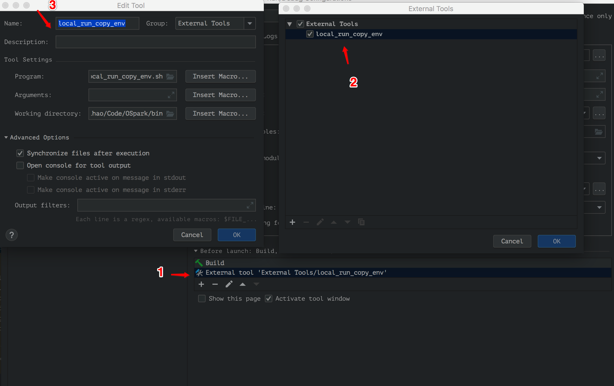

# OSpark

[toc]

## 多环境变量

通过 `sbt -Denv=prod` 的方式解决，支持4个环境变量 dev、test、stage、prod

## 本地运行

需要配置 run config，如下图所示



## 打包

打包命令

```
sbt -Denv=prod clean package
```

发布命令

```
sbt -Denv=prod clean release
```

## spark.yarn.archive

解决每次 submit 都要上传依赖的问题

```
sbt -Denv=prod sparkArchive
```
会在根目录生成 OSpark_lib.zip 上传到 hdfs 即可

```
kinit -kt /opt/keytab/zhaihao.keytab zhaihao@U51.COM
hdfs dfs -rm /user/zhaihao/OSpark_lib.zip
hdfs dfs -put OSpark_lib.zip /user/zhaihao/OSpark_lib.zip
```

然后配置

```
--conf spark.yarn.archive=hdfs://nameservice1/user/zhaihao/OSpark_lib.zip
```

项目有依赖变更时，需要重新打包上传

